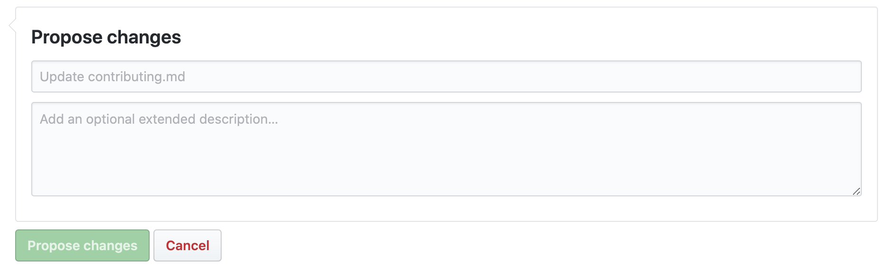

# Katkıda Bulunma

1. Github üzerinde düzenleme göndermek için, README.md sayfanın sağ üstünde bulunan  **Edit This File** butonuna tıklayın. Değişiklikleri bu sayfada yaptıktan sonra gönderebilirsiniz. Markdown editör kullanarak değişiklikleri önizleyebilirsiniz bunun için stackedit.io/app web sitesini kullanabilirsiniz.
   

2. Sayfada güncelleme yaptıktan sonra, önce en altta bulunan **Propose File Change** butonuna sonra da açılan sayfada **Create Pull Request** butonuna tıklayın.

## Dikkat Edilmesi Gerekenler

 - Paylaşılan içeriklerin güncelliği ve doğruluğu sorgulanmalıdır.
  
 - Paylaşılam içerikler Türkçe olmak zorundadır.
  
 - İçerik bağlantısı "Yazı,Video Başlığı - Yazar" şeklinde olmalıdır.
  
 - Sayfadaki içerikler kategorize edilmiştir, doğru kategoriye ekleme yaptığınızdan emin olmalısınız.
  
 - Markdown standartlarına uyulmalıdır (başlıklar ve alt başlıklar)
  
 - Verilen bağlantıların çalışıyor olması gerekmektedir.
  
 - Kitap bağlantıları için, öncelikli olarak yazarın ele aldığı bir tanıtım veya ön yazıyı referans veriniz, böylesi bir içerik yoksa, e-ticaret firma referansı vermek yerine goodreads.com sitesinde arama yaparak buradaki bağlantısı eklenmelidir.

- Korsan içerik satışı yapilan siteler, içeriğin doğrudan indirme linki, kitaplar için pdf indirme adresi, online eğitim setleri için satın alınmış kullanıcı hesabı bilgileri verilmemelidir. 

 
 

**Gönderilen düzenlemeler yukarıdaki maddeler doğrultusunda incelenecektir.**